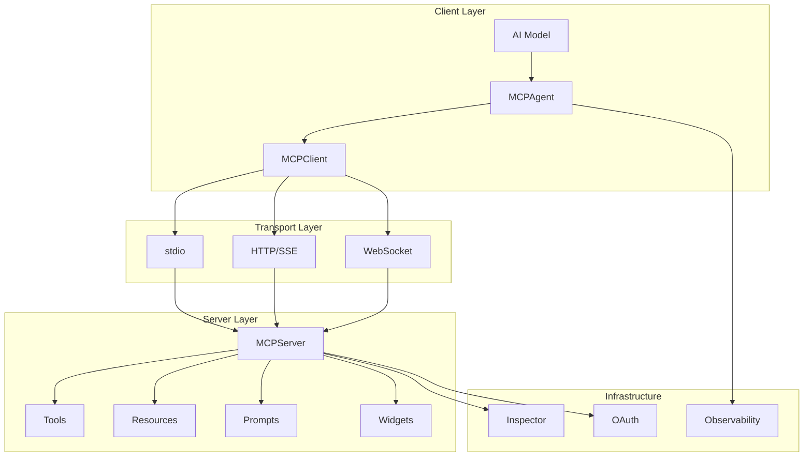
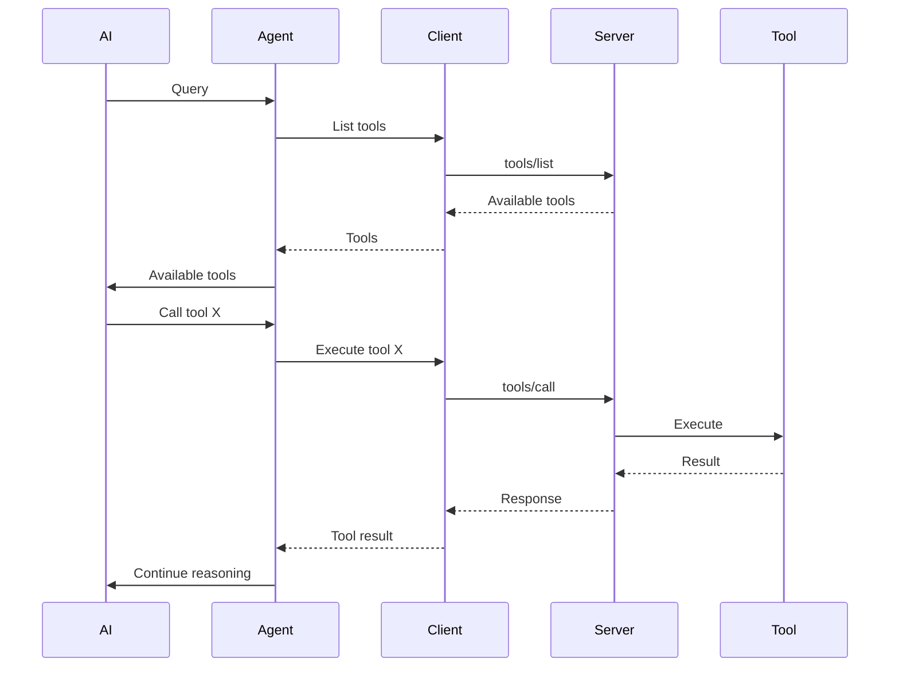

## Overview

mcp-use is a fullstack MCP framework with implementations in both TypeScript and Python. The architecture is designed for modularity, extensibility, and ease of use.

## High-Level Architecture



## Core Components

### MCPServer

The server component implements the MCP protocol and provides the foundation for building MCP servers.

<Tabs>
  <Tab title="TypeScript">
    
**Location**: `packages/mcp-use/src/server/`

```typescript
import { MCPServer } from "mcp-use/server";

const server = new MCPServer({
  name: "my-server",
  version: "1.0.0",
  description: "Server description",
});

// Server is built on Hono (web framework)
server.get("/health", (c) => c.text("OK"));

await server.listen(3000);
```

**Key Features**:
- Built on Hono web framework for performance
- Automatic inspector mounting at `/inspector`
- MCP endpoints at `/mcp` (HTTP/SSE)
- Hot reload in development mode
- Automatic widget discovery
- Type-safe tool registration

**Architecture**:
```
MCPServer
  ├── Hono App (HTTP server)
  ├── Tool Registry
  ├── Resource Registry
  ├── Prompt Registry
  ├── Widget Manager
  ├── Session Manager
  ├── Inspector
  └── OAuth Handler
```

  </Tab>
  
  <Tab title="Python">
    
**Location**: `libraries/python/mcp_use/server/`

```python
from mcp_use import MCPServer

server = MCPServer(
    name="my-server",
    version="1.0.0",
    description="Server description",
)

@server.tool(
    name="example",
    description="Example tool",
)
async def example_tool(input: str) -> str:
    return f"Result: {input}"

server.run(transport="streamable-http", port=8000)
```

**Key Features**:

- Decorator-based API
- Automatic inspector integration
- Multiple transport support
- Type validation with Pydantic
- Built-in telemetry

</Tab>
</Tabs>

### MCPClient

The client component manages connections to MCP servers and handles tool discovery.

<Tabs>
  <Tab title="TypeScript">
    
**Location**: `packages/mcp-use/src/client.ts`

```typescript
import { MCPClient } from "mcp-use/client";

const client = MCPClient.fromDict({
  mcpServers: {
    filesystem: {
      command: "npx",
      args: ["-y", "@modelcontextprotocol/server-filesystem", "/tmp"]
    },
    weather: {
      url: "http://localhost:3000/mcp"  // HTTP transport
    }
  }
});

await client.createAllSessions();
const tools = await client.getTools();
```

**Architecture**:
```
MCPClient
  ├── Configuration Manager
  ├── Session Manager
  │   ├── stdio Sessions
  │   ├── HTTP Sessions
  │   └── WebSocket Sessions
  ├── Tool Aggregator
  ├── Resource Manager
  └── Connection Pool
```

**Key Responsibilities**:
- Server lifecycle management
- Connection multiplexing
- Tool/resource discovery
- Session state management
- Transport abstraction

</Tab>
  
  <Tab title="Python">
    
**Location**: `libraries/python/mcp_use/client.py`

```python
from mcp_use import MCPClient

config = {
    "mcpServers": {
        "filesystem": {
            "command": "npx",
            "args": ["-y", "@modelcontextprotocol/server-filesystem", "/tmp"]
        }
    }
}

client = MCPClient.from_dict(config)
await client.create_all_sessions()

session = client.get_session("filesystem")
result = await session.call_tool("read_file", {"path": "test.txt"})
```

**Key Features**:
- Async/await support
- Multiple connector types
- Session management
- E2B sandbox support
- Configuration from files/dicts

</Tab>
</Tabs>

### MCPAgent

The agent component provides high-level AI agent functionality with LangChain integration.

<Tabs>
  <Tab title="TypeScript">
    
**Location**: `packages/mcp-use/src/agents/`

```typescript
import { MCPAgent } from "mcp-use/agent";
import { ChatOpenAI } from "@langchain/openai";

const agent = new MCPAgent({
  llm: new ChatOpenAI({ modelName: "gpt-4o" }),
  client,
  maxSteps: 20,
  useServerManager: true,  // Smart server selection
});

// Three execution modes
const result = await agent.run("Query");           // Simple
for await (const step of agent.stream("Query")) {   // Step-by-step
  console.log(step);
}
for await (const event of agent.streamEvents("Q")) { // Token-level
  console.log(event);
}
```

**Architecture**:
```
MCPAgent
  ├── LangChain Agent
  ├── MCPClient
  ├── Tool Adapter
  ├── Server Manager (optional)
  ├── Observability Manager
  ├── Memory (conversation history)
  └── Streaming Handler
```

**Key Features**:
- Multiple streaming modes
- LLM-agnostic (any LangChain LLM)
- Observability integration (Langfuse)
- Dynamic server selection
- Conversation memory
- Tool access control

</Tab>
  
  <Tab title="Python">
    
**Location**: `libraries/python/mcp_use/agents/`

```python
from mcp_use import MCPAgent
from langchain_openai import ChatOpenAI

agent = MCPAgent(
    llm=ChatOpenAI(model="gpt-4o"),
    client=client,
    max_steps=30,
    use_server_manager=True,
)

result = await agent.run("Find restaurants in Tokyo")

# Streaming
async for chunk in agent.stream("Query"):
    print(chunk["messages"], end="", flush=True)
```

**Architecture**:
```
MCPAgent
  ├── LangChain Agent
  ├── MCPClient
  ├── LangChain Adapter
  ├── Server Manager
  ├── Tool Restrictions
  └── Telemetry
```

</Tab>
</Tabs>

## Transport Layer

mcp-use supports three transport mechanisms:

### stdio Transport

For local process communication:

```typescript
const config = {
  mcpServers: {
    local: {
      command: "node",
      args: ["./server.js"],
      env: { DEBUG: "true" }
    }
  }
};
```

**Pros**:
- Simple setup
- No network configuration
- Process isolation

**Cons**:
- Local only
- No HTTP features

### HTTP/SSE Transport

For HTTP-based communication with Server-Sent Events:

```typescript
const config = {
  mcpServers: {
    remote: {
      url: "http://localhost:3000/mcp"
    }
  }
};
```

**Pros**:
- Works over network
- Firewall-friendly
- Browser compatible
- Inspector integration

**Cons**:
- Requires server setup
- HTTP overhead

### WebSocket Transport

For bidirectional communication:

```typescript
const config = {
  mcpServers: {
    realtime: {
      url: "ws://localhost:3000/ws"
    }
  }
};
```

**Pros**:
- Real-time bidirectional
- Low latency
- Efficient for streams

**Cons**:
- More complex setup
- Connection management

## Widget System (TypeScript)

### Architecture

```
Widget System
  ├── Widget Discovery
  │   └── Scans resources/ directory
  ├── Widget Bundler
  │   └── esbuild for React components
  ├── Widget Server
  │   └── Serves bundled widgets
  ├── Widget Adapter
  │   ├── ChatGPT (Apps SDK)
  │   └── MCP Apps (SEP-1865)
  └── Type Generation
      └── Generates TypeScript types
```

### Widget Lifecycle

<Steps>
  <Step title="Discovery">
    Server scans `resources/` directory for `widget.tsx` files
  </Step>
  <Step title="Bundling">
    esbuild compiles React components with dependencies
  </Step>
  <Step title="Registration">
    Widgets auto-register with metadata
  </Step>
  <Step title="Type Generation">
    TypeScript types generated for `useCallTool`
  </Step>
  <Step title="Serving">
    Widgets served at `/widgets/{name}`
  </Step>
  <Step title="Rendering">
    Client renders widget with props
  </Step>
</Steps>

### Widget Example

```tsx
// resources/weather/widget.tsx
import { useWidget, type WidgetMetadata } from "mcp-use/react";
import { z } from "zod";

const propSchema = z.object({
  city: z.string(),
  temp: z.number(),
});

export const widgetMetadata: WidgetMetadata = {
  description: "Weather display",
  props: propSchema,
};

export default function WeatherWidget() {
  const { props, callTool, theme } = useWidget<z.infer<typeof propSchema>>();
  
  return (
    <div style={{ background: theme === "dark" ? "#000" : "#fff" }}>
      <h2>{props.city}</h2>
      <p>{props.temp}°F</p>
    </div>
  );
}
```

## Inspector

The built-in inspector is a critical development tool:

**Features**:
- Test tools with custom inputs
- View resources
- Try prompts
- See server logs
- Monitor performance
- OAuth flow testing

**Auto-Mounting**:
```typescript
await server.listen(3000);
// Inspector automatically at http://localhost:3000/inspector
```

**Standalone Usage**:
```bash
npx @mcp-use/inspector --url http://localhost:3000/mcp
```

## Observability

### Architecture

```
Observability Manager
  ├── Langfuse Integration
  ├── Trace Management
  ├── Metadata Tracking
  ├── Tag Management
  └── Performance Metrics
```

### Usage

```typescript
const agent = new MCPAgent({
  llm,
  client,
  observe: true,  // Enable observability
});

// Set metadata for tracking
agent.setMetadata({
  userId: "user123",
  sessionId: "session456",
});

agent.setTags(["production", "user-query"]);

const result = await agent.run("Query");
```

## Data Flow

### Tool Execution Flow



## Extension Points

mcp-use is designed for extensibility:

### Custom Transports

```typescript
class CustomTransport implements Transport {
  async connect() { /* ... */ }
  async send(message: any) { /* ... */ }
  async receive(): Promise<any> { /* ... */ }
  async close() { /* ... */ }
}
```

### Custom Adapters

```typescript
class CustomAdapter {
  async createTools(client: MCPClient) {
    // Convert MCP tools to your framework's format
  }
}
```

### Middleware

```typescript
const server = new MCPServer({ /* ... */ });

// Add custom middleware
server.use(async (c, next) => {
  console.log(`Request: ${c.req.path}`);
  await next();
});
```

## Performance Considerations

### TypeScript

- **Hono framework**: Fast HTTP handling
- **esbuild**: Fast widget bundling
- **Connection pooling**: Reuse connections
- **Lazy loading**: Load widgets on demand

### Python

- **asyncio**: Non-blocking I/O
- **Connection pooling**: Efficient resource use
- **Lazy imports**: Faster startup

## Security

### Authentication

```typescript
const server = new MCPServer({
  oauth: {
    clientId: process.env.CLIENT_ID,
    clientSecret: process.env.CLIENT_SECRET,
    authorizationUrl: "https://oauth.example.com/authorize",
    tokenUrl: "https://oauth.example.com/token",
  },
});
```

### Tool Restrictions

```typescript
const agent = new MCPAgent({
  llm,
  client,
  disallowedTools: ["file_delete", "system_command"],
});
```

### Sandboxing (Python)

```python
client = MCPClient(
    config=config,
    sandbox=True,
    sandbox_options={"api_key": os.getenv("E2B_API_KEY")},
)
```

## Learn More

<CardGroup cols={2}>
  <Card title="Building Servers" icon="server" href="/guides/building-your-first-server">
    Practical guide to server development
  </Card>
  <Card title="MCP Protocol" icon="network-wired" href="/concepts/mcp-protocol">
    Protocol specification details
  </Card>
  <Card title="API Reference" icon="book" href="/api-reference">
    Complete API documentation
  </Card>
  <Card title="Examples" icon="code" href="https://github.com/mcp-use/mcp-use/tree/main/libraries/typescript/packages/mcp-use/examples">
    Browse code examples
  </Card>
</CardGroup>
