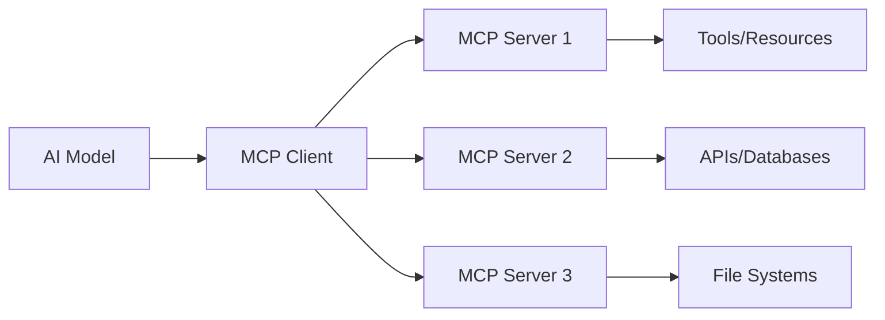

## What is the Model Context Protocol?

The **Model Context Protocol (MCP)** is an open standard that enables AI applications to securely connect to external data sources and tools. It provides a universal way for AI models to interact with the outside world through a standardized interface.

<Note>
  Think of MCP as "USB for AI" - a universal connector that lets AI models plug into any tool or data source through a common protocol.
</Note>

## Why MCP Matters

Traditional AI integrations require custom code for each tool or data source. MCP solves this by:

<CardGroup cols={2}>
  <Card title="Universal Standard" icon="plug">
    One protocol to connect AI models to any tool, API, or data source
  </Card>
  <Card title="Security First" icon="shield">
    Built-in authentication, authorization, and sandboxed execution
  </Card>
  <Card title="Composability" icon="puzzle-piece">
    Mix and match tools from different providers seamlessly
  </Card>
  <Card title="Future-Proof" icon="rocket">
    Open standard that evolves with the AI ecosystem
  </Card>
</CardGroup>

## Core Architecture

MCP follows a client-server architecture:



### Components

<Tabs>
  <Tab title="MCP Client">
    **MCP Client** is the component that AI applications use to connect to MCP servers.
    
    The client:
    - Discovers available tools and resources from servers
    - Manages connections to multiple servers simultaneously
    - Routes tool calls to the appropriate server
    - Handles authentication and session management
    
    Example:
    ```typescript
    import { MCPClient } from "mcp-use";
    
    const client = MCPClient.fromDict({
      mcpServers: {
        filesystem: {
          command: "npx",
          args: ["-y", "@modelcontextprotocol/server-filesystem", "/tmp"]
        }
      }
    });
    ```
  </Tab>
  
  <Tab title="MCP Server">
    **MCP Server** exposes tools, resources, and prompts that AI models can use.
    
    The server:
    - Implements the MCP protocol specification
    - Provides tools (functions AI can call)
    - Exposes resources (data AI can read)
    - Offers prompts (templates for common tasks)
    
    Example:
    ```typescript
    import { MCPServer, text } from "mcp-use/server";
    import { z } from "zod";
    
    const server = new MCPServer({
      name: "my-server",
      version: "1.0.0",
    });
    
    server.tool({
      name: "search",
      description: "Search the web",
      schema: z.object({ query: z.string() }),
    }, async ({ query }) => {
      return text(`Results for: ${query}`);
    });
    
    await server.listen(3000);
    ```
  </Tab>
  
  <Tab title="Transport Layer">
    **Transport Layer** handles communication between clients and servers.
    
    MCP supports multiple transports:
    
    | Transport | Use Case | Example |
    |-----------|----------|----------|
    | **stdio** | Local processes | Command-line tools |
    | **HTTP/SSE** | Web servers | Cloud-hosted services |
    | **WebSocket** | Bidirectional | Real-time updates |
    
    mcp-use handles all transports automatically:
    
    ```typescript
    // stdio transport (local process)
    const config1 = {
      mcpServers: {
        local: {
          command: "node",
          args: ["./server.js"]
        }
      }
    };
    
    // HTTP transport (remote server)
    const config2 = {
      mcpServers: {
        remote: {
          url: "http://localhost:3000/mcp"
        }
      }
    };
    ```
  </Tab>
</Tabs>

## MCP Protocol Flow

Here's how a typical MCP interaction works:

<Steps>
  <Step title="Initialization">
    The client connects to the server and exchanges capabilities.
    
    ```json
    {
      "jsonrpc": "2.0",
      "method": "initialize",
      "params": {
        "protocolVersion": "2024-11-05",
        "capabilities": {}
      }
    }
    ```
  </Step>
  
  <Step title="Discovery">
    The client discovers available tools, resources, and prompts.
    
    ```typescript
    const tools = await session.listTools();
    console.log(tools);
    // [
    //   { name: "search_web", description: "Search the web" },
    //   { name: "read_file", description: "Read a file" }
    // ]
    ```
  </Step>
  
  <Step title="Execution">
    The AI model decides which tool to call and provides arguments.
    
    ```json
    {
      "jsonrpc": "2.0",
      "method": "tools/call",
      "params": {
        "name": "search_web",
        "arguments": {
          "query": "MCP protocol"
        }
      }
    }
    ```
  </Step>
  
  <Step title="Response">
    The server executes the tool and returns results.
    
    ```json
    {
      "jsonrpc": "2.0",
      "result": {
        "content": [
          {
            "type": "text",
            "text": "Found 10 results for MCP protocol..."
          }
        ]
      }
    }
    ```
  </Step>
</Steps>

## Protocol Specification

MCP is built on JSON-RPC 2.0 with specific message types:

### Message Types

<Tabs>
  <Tab title="Tools">
    **Tools** are functions that AI models can call to perform actions.
    
    ```typescript
    // Server side
    server.tool({
      name: "calculate",
      description: "Perform calculations",
      schema: z.object({
        expression: z.string(),
      }),
    }, async ({ expression }) => {
      const result = eval(expression);
      return text(`Result: ${result}`);
    });
    
    // Client side
    const result = await session.callTool("calculate", {
      expression: "2 + 2"
    });
    ```
  </Tab>
  
  <Tab title="Resources">
    **Resources** provide read-only access to data.
    
    ```typescript
    // Server side
    server.resource({
      name: "user-data",
      uri: "app://users/{id}",
      title: "User Data",
    }, async ({ id }) => {
      const user = await db.getUser(id);
      return text(JSON.stringify(user));
    });
    
    // Client side
    const data = await session.readResource("app://users/123");
    ```
  </Tab>
  
  <Tab title="Prompts">
    **Prompts** are reusable templates for common tasks.
    
    ```typescript
    // Server side
    server.prompt({
      name: "code-review",
      description: "Review code for quality",
      schema: z.object({
        code: z.string(),
        language: z.string(),
      }),
    }, async ({ code, language }) => {
      return text(
        `Review this ${language} code:\n\n${code}`
      );
    });
    
    // Client side
    const prompt = await session.getPrompt("code-review", {
      code: "function hello() { return 'world'; }",
      language: "javascript"
    });
    ```
  </Tab>
  
  <Tab title="Sampling">
    **Sampling** allows servers to request LLM completions.
    
    ```typescript
    // Server can request AI completion
    server.on("sampling/createMessage", async (request) => {
      // Server requests AI to process something
      return {
        role: "assistant",
        content: {
          type: "text",
          text: "AI-generated response"
        }
      };
    });
    ```
  </Tab>
</Tabs>

## Advanced Features

### Progress Notifications

Servers can send progress updates during long-running operations:

```typescript
server.tool({
  name: "process-large-file",
  schema: z.object({ file: z.string() }),
}, async ({ file }, { progress }) => {
  progress?.({ progress: 0, total: 100 });
  
  // ... processing ...
  
  progress?.({ progress: 50, total: 100 });
  
  // ... more processing ...
  
  progress?.({ progress: 100, total: 100 });
  return text("Done!");
});
```

### Logging

Servers can emit structured logs:

```typescript
server.on("logging/setLevel", async (level) => {
  console.log(`Log level set to: ${level}`);
});

// Emit logs
server.log("info", "Processing started");
server.log("debug", "Detailed information", { extra: "data" });
```

### Authentication

MCP supports OAuth and custom authentication:

```typescript
const server = new MCPServer({
  name: "secure-server",
  version: "1.0.0",
  oauth: {
    clientId: process.env.OAUTH_CLIENT_ID,
    clientSecret: process.env.OAUTH_CLIENT_SECRET,
    authorizationUrl: "https://oauth.example.com/authorize",
    tokenUrl: "https://oauth.example.com/token",
  },
});
```

## Protocol Versions

mcp-use supports the latest MCP protocol version:

- **Current**: `2024-11-05`
- **Features**: Tools, Resources, Prompts, Sampling, Roots, Authentication
- **Transports**: stdio, HTTP/SSE, WebSocket

<Tip>
  mcp-use automatically negotiates the protocol version with servers, so you don't need to worry about version compatibility.
</Tip>

## Standards Compliance

mcp-use is fully compliant with the official MCP specification:

| Feature | TypeScript | Python |
|---------|------------|--------|
| Tools | ✅ | ✅ |
| Resources | ✅ | ✅ |
| Prompts | ✅ | ✅ |
| Sampling | ✅ | ✅ |
| Roots | ✅ | ✅ |
| Authentication | ✅ | ✅ |
| stdio Transport | ✅ | ✅ |
| HTTP/SSE Transport | ✅ | ✅ |
| WebSocket Transport | ✅ | ✅ |

## Learn More

<CardGroup cols={2}>
  <Card title="Official MCP Spec" icon="book" href="https://modelcontextprotocol.io">
    Read the official Model Context Protocol specification
  </Card>
  <Card title="MCP Servers" icon="server" href="/concepts/servers-vs-apps">
    Understand the difference between MCP Servers and Apps
  </Card>
  <Card title="Tools, Resources, Prompts" icon="toolbox" href="/concepts/tools-resources-prompts">
    Deep dive into MCP primitives
  </Card>
  <Card title="Architecture" icon="diagram-project" href="/concepts/architecture">
    Learn about mcp-use architecture
  </Card>
</CardGroup>
