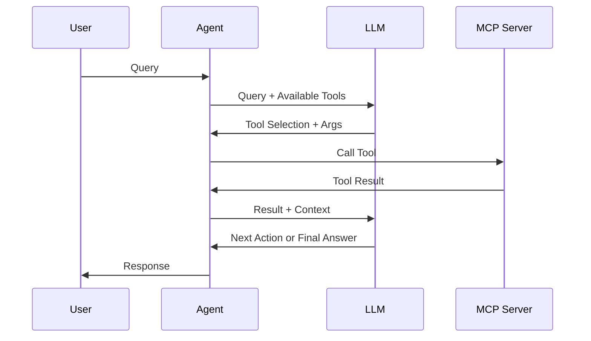

## What is MCPAgent?

MCPAgent is an AI-powered agent that can use tools from MCP servers to accomplish complex tasks. It reasons across multiple steps, selecting and executing tools as needed to complete user queries.

## Key Features

<CardGroup cols={2}>
  <Card title="Multi-Step Reasoning" icon="brain">
    Agents plan and execute complex workflows
  </Card>
  <Card title="Tool Selection" icon="hand-pointer">
    Automatically chooses the right tools
  </Card>
  <Card title="Streaming Support" icon="stream">
    Real-time execution updates
  </Card>
  <Card title="Memory" icon="database">
    Conversation history for context
  </Card>
  <Card title="Multi-Server" icon="server">
    Access tools from multiple servers
  </Card>
  <Card title="LLM Agnostic" icon="stars">
    Works with any LangChain LLM
  </Card>
</CardGroup>

## Quick Example

```python
import asyncio
from dotenv import load_dotenv
from langchain_openai import ChatOpenAI
from mcp_use import MCPAgent, MCPClient

load_dotenv()

config = {
    "mcpServers": {
        "playwright": {
            "command": "npx",
            "args": ["@playwright/mcp@latest"]
        }
    }
}

async def main():
    client = MCPClient(config=config)
    llm = ChatOpenAI(model="gpt-4o")
    agent = MCPAgent(llm=llm, client=client, max_steps=30)
    
    result = await agent.run(
        "Find the top 3 restaurants in San Francisco using Google search"
    )
    print(result)
    
    await client.close_all_sessions()

asyncio.run(main())
```

## How It Works



## Agent Configuration

### Basic Setup

```python
from mcp_use import MCPAgent, MCPClient
from langchain_openai import ChatOpenAI

client = MCPClient.from_config_file("config.json")
llm = ChatOpenAI(model="gpt-4o")

agent = MCPAgent(
    llm=llm,
    client=client,
    max_steps=30,
    memory_enabled=True,
    verbose=False
)
```

### Configuration Parameters

<ParamField path="llm" type="BaseLanguageModel" required>
  LangChain LLM with tool calling support
</ParamField>

<ParamField path="client" type="MCPClient">
  MCPClient instance (either client or connectors required)
</ParamField>

<ParamField path="connectors" type="list[BaseConnector]">
  List of connectors (alternative to client)
</ParamField>

<ParamField path="max_steps" type="int" default="5">
  Maximum number of reasoning steps
</ParamField>

<ParamField path="memory_enabled" type="bool" default="True">
  Maintain conversation history
</ParamField>

<ParamField path="system_prompt" type="str">
  Custom system prompt override
</ParamField>

<ParamField path="additional_instructions" type="str">
  Extra instructions to append
</ParamField>

<ParamField path="disallowed_tools" type="list[str]">
  Tools to exclude from agent
</ParamField>

<ParamField path="verbose" type="bool" default="False">
  Enable verbose logging
</ParamField>

<ParamField path="pretty_print" type="bool" default="False">
  Pretty print execution steps
</ParamField>

## Running Queries

### Basic Execution

```python
result = await agent.run("What's the weather in Tokyo?")
print(result)
```

### With Custom Max Steps

```python
result = await agent.run(
    "Research and summarize the latest AI developments",
    max_steps=50  # Allow more reasoning steps
)
```

### Streaming Execution

```python
async for step in agent.stream("Find and analyze GitHub trends"):
    if isinstance(step, str):
        print(f"Final Result: {step}")
    else:
        action, observation = step
        print(f"Tool: {action.tool}")
        print(f"Input: {action.tool_input}")
        print(f"Output: {observation}")
```

## Supported LLMs

mcp-use works with any LangChain-compatible LLM that supports tool calling:

<CodeGroup>

```python OpenAI
from langchain_openai import ChatOpenAI

llm = ChatOpenAI(model="gpt-4o")
agent = MCPAgent(llm=llm, client=client)
```

```python Anthropic
from langchain_anthropic import ChatAnthropic

llm = ChatAnthropic(model="claude-sonnet-4-5")
agent = MCPAgent(llm=llm, client=client)
```

```python Google
from langchain_google_genai import ChatGoogleGenerativeAI

llm = ChatGoogleGenerativeAI(model="gemini-2.0-flash-exp")
agent = MCPAgent(llm=llm, client=client)
```

```python Groq
from langchain_groq import ChatGroq

llm = ChatGroq(model="llama-3.3-70b-versatile")
agent = MCPAgent(llm=llm, client=client)
```

</CodeGroup>

## Agent Capabilities

### Multi-Step Reasoning

Agents can break down complex tasks:

```python
result = await agent.run("""
Research the top 5 tech companies, find their latest products,
and create a comparison table.
""")
```

The agent will:
1. Search for top tech companies
2. For each company, find latest products
3. Organize information into a table
4. Return formatted results

### Tool Combination

Agents use multiple tools together:

```python
config = {
    "mcpServers": {
        "browser": {"command": "npx", "args": ["@playwright/mcp@latest"]},
        "filesystem": {"command": "npx", "args": ["-y", "@modelcontextprotocol/server-filesystem", "/tmp"]}
    }
}

result = await agent.run("""
Search for Python best practices, extract key points,
and save them to /tmp/python-best-practices.txt
""")
```

The agent will:
1. Use browser tools to search
2. Extract information
3. Use filesystem tools to save

### Context Retention

With memory enabled, agents maintain context:

```python
agent = MCPAgent(llm=llm, client=client, memory_enabled=True)

# First query
await agent.run("My name is Alice")

# Second query - agent remembers
result = await agent.run("What's my name?")
print(result)  # "Your name is Alice"
```

## Error Handling

### Tool Error Retry

By default, agents retry on tool errors:

```python
agent = MCPAgent(
    llm=llm,
    client=client,
    retry_on_error=True  # Default
)

# If a tool fails, agent can try again with corrected input
result = await agent.run("Calculate 10 divided by 0")
# Agent will handle the error and try alternative approaches
```

### Disable Error Retry

```python
agent = MCPAgent(
    llm=llm,
    client=client,
    retry_on_error=False  # Halt on first error
)
```

## Agent Lifecycle

### Initialization

```python
agent = MCPAgent(llm=llm, client=client, auto_initialize=False)

# Initialize explicitly
await agent.initialize()

# Now ready to use
result = await agent.run("Query")
```

### Cleanup

```python
try:
    result = await agent.run("Query")
finally:
    await agent.close()
```

## Best Practices

<AccordionGroup>
  <Accordion title="Set Appropriate Max Steps">
    Balance between capability and cost:
    ```python
    # Simple queries
    agent = MCPAgent(llm=llm, client=client, max_steps=5)
    
    # Complex research
    agent = MCPAgent(llm=llm, client=client, max_steps=50)
    ```
  </Accordion>

  <Accordion title="Use Verbose Mode for Debugging">
    Enable verbose logging during development:
    ```python
    agent = MCPAgent(
        llm=llm,
        client=client,
        verbose=True,
        pretty_print=True
    )
    ```
  </Accordion>

  <Accordion title="Clear Instructions">
    Provide specific, clear queries:
    ```python
    # Good
    "Search Google for 'Python async best practices' and summarize the top 3 results"
    
    # Avoid
    "Find stuff about Python"
    ```
  </Accordion>

  <Accordion title="Manage Conversation History">
    Clear history when context is no longer needed:
    ```python
    agent.clear_conversation_history()
    ```
  </Accordion>
</AccordionGroup>

## Next Steps

<CardGroup cols={2}>
  <Card title="Basic Usage" icon="play" href="/python/agent/basic-usage">
    Learn agent fundamentals
  </Card>
  <Card title="Streaming" icon="stream" href="/python/agent/streaming">
    Real-time agent execution
  </Card>
  <Card title="Memory" icon="database" href="/python/agent/memory">
    Manage conversation context
  </Card>
  <Card title="Server Manager" icon="server" href="/python/agent/server-manager">
    Dynamic server selection
  </Card>
</CardGroup>