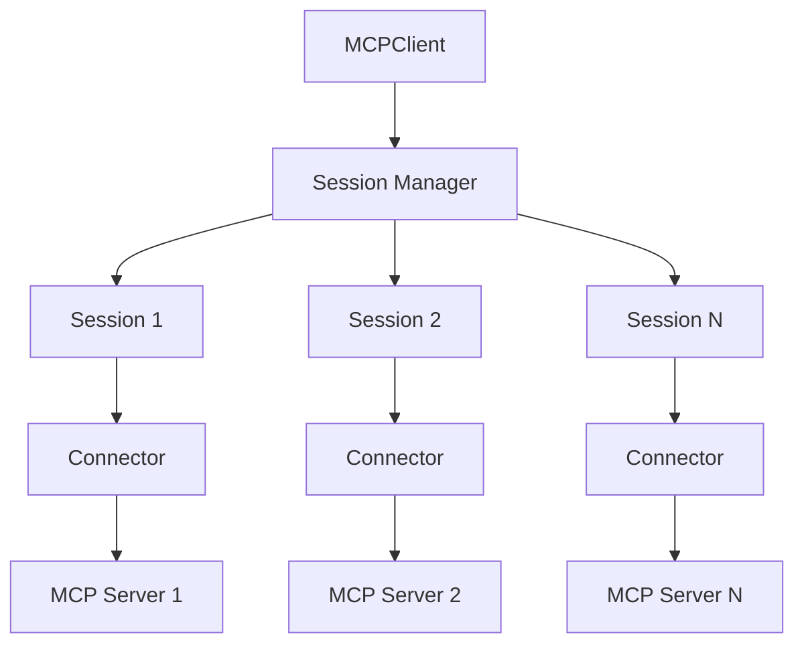

## What is MCPClient?

MCPClient provides direct programmatic access to MCP servers without requiring an AI agent. Use it when you know exactly which tools to call and don't need AI reasoning.

## Key Features

<CardGroup cols={2}>
  <Card title="Direct Tool Calls" icon="screwdriver-wrench">
    Call MCP tools without an LLM
  </Card>
  <Card title="Multi-Server Support" icon="server">
    Connect to multiple servers simultaneously
  </Card>
  <Card title="Resource Access" icon="database">
    Read resources from servers
  </Card>
  <Card title="Prompt Management" icon="message">
    Retrieve and use server prompts
  </Card>
  <Card title="Multiple Transports" icon="network-wired">
    Stdio, HTTP, WebSocket support
  </Card>
  <Card title="Session Management" icon="link">
    Automatic connection handling
  </Card>
</CardGroup>

## Quick Example

```python
import asyncio
from mcp_use import MCPClient

config = {
    "mcpServers": {
        "calculator": {
            "command": "npx",
            "args": ["-y", "@modelcontextprotocol/server-everything"]
        }
    }
}

async def main():
    client = MCPClient(config=config)
    await client.create_all_sessions()
    
    session = client.get_session("calculator")
    result = await session.call_tool("add", {"a": 5, "b": 3})
    
    print(result.content[0].text)  # Output: 8
    
    await client.close_all_sessions()

asyncio.run(main())
```

## Client vs Agent

### When to use MCPClient

- **Known operations**: You know exactly which tools to call
- **Deterministic workflows**: Fixed sequence of operations
- **Automation scripts**: Integrate MCP tools into scripts
- **Testing**: Test MCP server functionality

```python
# Direct tool calling
result = await session.call_tool("search", {"query": "python"})
```

### When to use MCPAgent

- **Complex tasks**: Multi-step reasoning required
- **Dynamic workflows**: Agent decides which tools to use
- **Natural language**: User provides queries in natural language
- **AI-driven**: Let the LLM figure out the solution

```python
# Agent-based
result = await agent.run("Find information about Python and summarize it")
```

## Architecture



## Core Concepts

### Configuration

Define servers in configuration:

```python
config = {
    "mcpServers": {
        "server-name": {
            "command": "npx",
            "args": ["package-name"],
            "env": {"KEY": "value"}
        }
    }
}
```

### Sessions

Each server connection is a session:

```python
await client.create_all_sessions()
session = client.get_session("server-name")
```

### Tools

Call tools directly:

```python
result = await session.call_tool("tool_name", arguments)
```

### Resources

Read resources:

```python
resources = await session.list_resources()
content = await session.read_resource(uri)
```

### Prompts

Retrieve prompts:

```python
prompts = await session.list_prompts()
prompt = await session.get_prompt("prompt_name", arguments)
```

## Creating a Client

### From Dictionary

```python
from mcp_use import MCPClient

config = {
    "mcpServers": {
        "filesystem": {
            "command": "npx",
            "args": ["-y", "@modelcontextprotocol/server-filesystem", "/tmp"]
        }
    }
}

client = MCPClient(config=config)
```

### From File

```python
client = MCPClient.from_config_file("config.json")
```

### From Dict Method

```python
client = MCPClient.from_dict(config)
```

## Basic Operations

### List Available Tools

```python
tools = await session.list_tools()
for tool in tools:
    print(f"{tool.name}: {tool.description}")
```

### Call a Tool

```python
result = await session.call_tool(
    name="write_file",
    arguments={
        "path": "/tmp/test.txt",
        "content": "Hello, World!"
    }
)

if result.isError:
    print(f"Error: {result.content}")
else:
    print(f"Success: {result.content[0].text}")
```

### Read Resources

```python
resources = await session.list_resources()
for resource in resources:
    content = await session.read_resource(resource.uri)
    print(f"{resource.name}: {content.contents[0].text}")
```

### Get Prompts

```python
prompts = await session.list_prompts()
for prompt in prompts:
    result = await session.get_prompt(
        prompt.name,
        arguments={"param": "value"}
    )
    for message in result.messages:
        print(message.content.text)
```

## Client Configuration Options

<ParamField path="config" type="str | dict">
  Configuration dict or path to JSON file
</ParamField>

<ParamField path="sandbox" type="bool" default="False">
  Enable sandboxed execution (requires E2B)
</ParamField>

<ParamField path="sandbox_options" type="SandboxOptions">
  Configuration for sandbox environment
</ParamField>

<ParamField path="code_mode" type="bool" default="False">
  Enable code execution mode
</ParamField>

<ParamField path="verify" type="bool" default="True">
  Verify SSL certificates for HTTP connections
</ParamField>

<ParamField path="middleware" type="list[Middleware]">
  Custom middleware for request processing
</ParamField>

## Error Handling

Handle errors gracefully:

```python
import asyncio
from mcp_use import MCPClient

async def main():
    client = MCPClient.from_config_file("config.json")
    
    try:
        await client.create_all_sessions()
        session = client.get_session("server-name")
        
        result = await session.call_tool("risky_operation", {})
        
        if result.isError:
            print(f"Tool returned error: {result.content}")
        else:
            print(f"Success: {result.content[0].text}")
            
    except ValueError as e:
        print(f"Configuration error: {e}")
    except RuntimeError as e:
        print(f"Connection error: {e}")
    finally:
        await client.close_all_sessions()

asyncio.run(main())
```

## Context Manager Pattern

Use async context managers for automatic cleanup:

```python
from mcp_use import MCPClient

async def main():
    client = MCPClient.from_config_file("config.json")
    await client.create_all_sessions()
    
    try:
        session = client.get_session("server-name")
        result = await session.call_tool("my_tool", {})
        print(result.content[0].text)
    finally:
        await client.close_all_sessions()
```

## Next Steps

<CardGroup cols={2}>
  <Card title="Configuration" icon="gear" href="/python/client/configuration">
    Configure client connections
  </Card>
  <Card title="Connecting" icon="link" href="/python/client/connecting">
    Establish server connections
  </Card>
  <Card title="Sessions" icon="network-wired" href="/python/client/sessions">
    Manage client sessions
  </Card>
  <Card title="API Reference" icon="book" href="/python/api/client">
    Complete client API docs
  </Card>
</CardGroup>