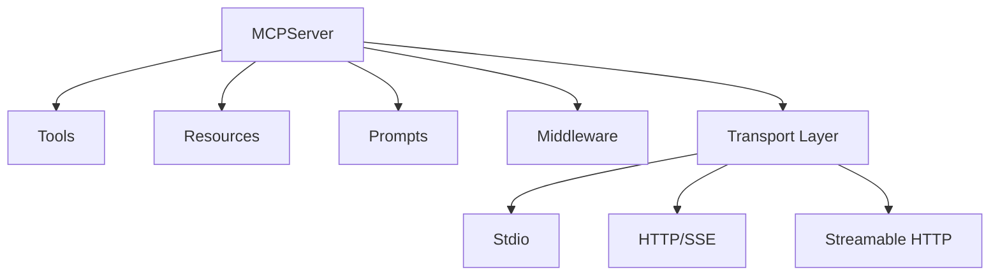

## What is an MCP Server?

An MCP Server exposes **tools**, **resources**, and **prompts** that AI agents can use through the Model Context Protocol. mcp-use provides a simple decorator-based API for creating production-ready MCP servers in Python.

## Key Features

<CardGroup cols={2}>
  <Card title="Simple Decorators" icon="at">
    Define tools, resources, and prompts with intuitive decorators
  </Card>
  <Card title="Multiple Transports" icon="network-wired">
    Support for stdio, SSE, and streamable HTTP
  </Card>
  <Card title="Built-in Inspector" icon="magnifying-glass">
    Debug mode with web UI for testing tools
  </Card>
  <Card title="Type Safety" icon="shield-check">
    Full type hints and Pydantic validation
  </Card>
  <Card title="Authentication" icon="lock">
    Built-in bearer token auth support
  </Card>
  <Card title="Middleware" icon="layer-group">
    Extensible middleware system
  </Card>
</CardGroup>

## Quick Example

```python
from mcp_use import MCPServer
from pydantic import Field
from typing import Annotated

server = MCPServer(
    name="my-server",
    version="1.0.0",
    instructions="A simple MCP server example"
)

@server.tool()
def get_weather(city: Annotated[str, Field(description="City name")]) -> dict:
    """Get weather for a city"""
    return {
        "temperature": 72,
        "condition": "sunny",
        "city": city
    }

if __name__ == "__main__":
    server.run()
```

## Architecture



## Core Concepts

### Tools

Tools are functions that AI agents can call to perform actions:

```python
@server.tool(
    name="search",
    description="Search for information"
)
async def search(query: str) -> str:
    return f"Results for: {query}"
```

### Resources

Resources provide read-only data that agents can access:

```python
@server.resource(
    uri="data://users",
    name="users",
    description="List of users"
)
async def get_users() -> str:
    return json.dumps([{"id": 1, "name": "Alice"}])
```

### Prompts

Prompts are reusable templates for agent interactions:

```python
@server.prompt(
    name="greeting",
    description="Personalized greeting"
)
async def greeting(name: str) -> str:
    return f"Hello, {name}! How can I help you today?"
```

## Transport Modes

### Stdio Transport

For command-line integration and local development:

```python
server.run(transport="stdio")
```

### HTTP Transport

For web-based integrations with server-sent events:

```python
server.run(
    transport="streamable-http",
    host="0.0.0.0",
    port=8000
)
```

## Debug Mode

Enable debug mode to access development tools:

```python
server = MCPServer(
    name="my-server",
    debug=True  # Enables /docs, /inspector, /openmcp.json
)

server.run(port=8000)
```

Debug endpoints:
- `http://localhost:8000/docs` - API documentation
- `http://localhost:8000/inspector` - Interactive tool testing UI
- `http://localhost:8000/openmcp.json` - OpenMCP metadata

## Context Access

Access request context in your tools:

```python
from mcp.server.fastmcp import Context

@server.tool()
async def get_session_info(context: Context) -> dict:
    """Access session and request information"""
    return {
        "session_id": context.request_context.session_id,
        "capabilities": context.request_context.capabilities
    }
```

## Error Handling

Return structured errors from tools:

```python
@server.tool()
async def divide(a: float, b: float) -> float:
    """Divide two numbers"""
    if b == 0:
        raise ValueError("Cannot divide by zero")
    return a / b
```

## Next Steps

<CardGroup cols={2}>
  <Card title="Creating Servers" icon="hammer" href="/python/server/creating-server">
    Learn to build MCP servers
  </Card>
  <Card title="Tools" icon="wrench" href="/python/server/tools">
    Define server tools
  </Card>
  <Card title="Resources" icon="database" href="/python/server/resources">
    Expose data resources
  </Card>
  <Card title="Transport" icon="network-wired" href="/python/server/transport">
    Configure transport protocols
  </Card>
</CardGroup>