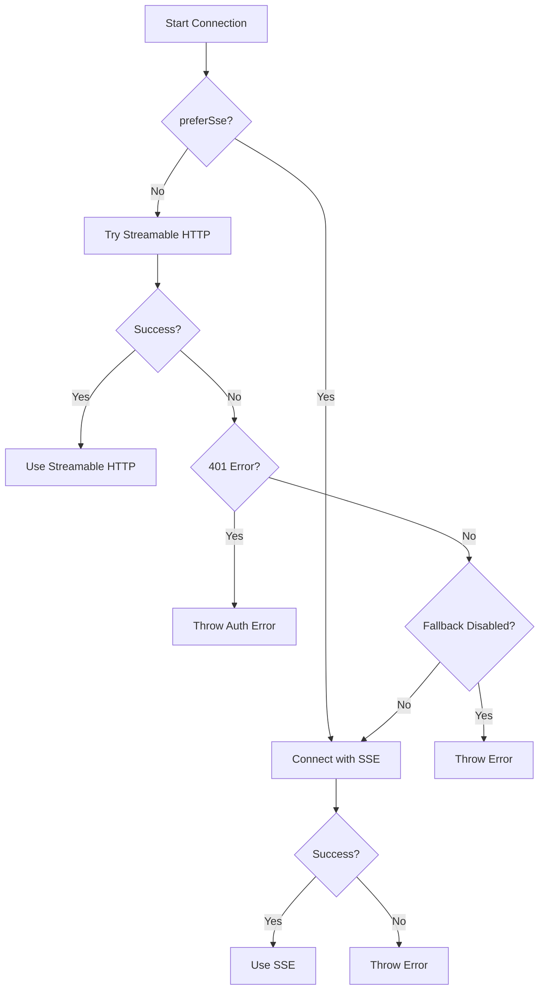

## Overview

MCPClient supports multiple transport protocols for connecting to MCP servers. The client automatically selects the appropriate connector based on your configuration and handles connection lifecycle, retries, and fallbacks.

## Transport Types

The mcp-use client supports three main transport types:

<CardGroup cols={3}>
  <Card title="Stdio" icon="terminal">
    **Process-based** communication via stdin/stdout. Best for local Node.js servers.
  </Card>
  <Card title="HTTP" icon="globe">
    **Streamable HTTP** with automatic SSE fallback. Best for remote servers.
  </Card>
  <Card title="WebSocket" icon="bolt">
    **Bidirectional streaming** (browser-only).
  </Card>
</CardGroup>

## Stdio Connector

The StdioConnector spawns a local process and communicates via standard input/output streams. This is the most efficient method for local servers.

### Configuration

```json mcp-config.json
{
  "mcpServers": {
    "filesystem": {
      "command": "npx",
      "args": ["-y", "@modelcontextprotocol/server-filesystem", "/tmp"],
      "env": {
        "DEBUG": "mcp:*",
        "NODE_ENV": "production"
      }
    }
  }
}
```

### How It Works

1. **Process Spawn** (`src/connectors/stdio.ts:49`): Client spawns the command with provided args
2. **Stream Setup**: Creates bidirectional stdio transport
3. **MCP Handshake**: Performs initialization protocol
4. **Ready**: Session is ready for tool calls

```typescript
import { MCPClient } from 'mcp-use';

const client = new MCPClient({
  mcpServers: {
    'python-server': {
      command: 'python',
      args: ['server.py'],
      env: {
        PYTHONPATH: '/app/lib',
        LOG_LEVEL: 'INFO'
      }
    },
    'node-server': {
      command: 'node',
      args: ['dist/server.js', '--port', '3000']
    }
  }
});

const session = await client.createSession('python-server');
console.log('Connected via stdio');
```

### Stdio Options

<ParamField path="command" type="string" required>
  Executable command. Can be absolute path or PATH-resolved binary.
  
  ```json
  "command": "npx"  // or "node", "python", "/usr/bin/python3"
  ```
</ParamField>

<ParamField path="args" type="string[]" required>
  Command line arguments passed to the process.
  
  ```json
  "args": ["-y", "@modelcontextprotocol/server-filesystem", "/data"]
  ```
</ParamField>

<ParamField path="env" type="Record<string, string>">
  Environment variables. Merged with `process.env` (`src/connectors/stdio.ts:60`).
  
  ```json
  "env": {
    "DEBUG": "*",
    "API_KEY": "secret"
  }
  ```
</ParamField>

### Stdio Best Practices

<AccordionGroup>
  <Accordion title="Use npx for npm Packages">
    Launch npm-published MCP servers easily:
    
    ```json
    {
      "command": "npx",
      "args": ["-y", "@modelcontextprotocol/server-filesystem", "/home"]
    }
    ```
  </Accordion>

  <Accordion title="Handle Process Cleanup">
    Always close sessions to terminate child processes:
    
    ```typescript
    const session = await client.createSession('my-server');
    try {
      // Use session...
    } finally {
      await client.closeSession('my-server'); // Kills process
    }
    ```
  </Accordion>

  <Accordion title="Monitor stderr">
    Server logs go to stderr by default:
    
    ```typescript
    import { StdioConnector } from 'mcp-use';
    import { Writable } from 'stream';
    
    const logStream = new Writable({
      write(chunk, encoding, callback) {
        console.log('[SERVER]', chunk.toString());
        callback();
      }
    });
    
    const connector = new StdioConnector({
      command: 'node',
      args: ['server.js'],
      errlog: logStream
    });
    ```
  </Accordion>
</AccordionGroup>

## HTTP Connector

The HttpConnector communicates with remote MCP servers over HTTP. It automatically tries streamable HTTP first, then falls back to SSE (Server-Sent Events) for maximum compatibility.

### Configuration

```json mcp-config.json
{
  "mcpServers": {
    "brave-search": {
      "url": "https://mcp.brave.com/mcp",
      "authToken": "${BRAVE_API_KEY}",
      "preferSse": false,
      "headers": {
        "X-Client-ID": "my-app"
      }
    }
  }
}
```

### Transport Selection

The HttpConnector follows this connection flow (`src/connectors/http.ts:185`):



### Streamable HTTP vs SSE

**Streamable HTTP** (`src/connectors/http.ts:276`):
- Uses HTTP POST for requests and responses
- Lower latency for request/response patterns
- Requires server support for `mcp-session-id` header
- Automatically extracts session ID from initialize response

**SSE (Server-Sent Events)** (`src/connectors/http.ts:418`):
- Uses HTTP POST + EventSource for streaming
- Better compatibility with existing HTTP servers
- Fallback when streamable HTTP is not available
- Works with FastMCP and other SSE-based servers

### HTTP Options

<ParamField path="url" type="string" required>
  Base URL of the MCP server endpoint.
  
  ```json
  "url": "https://api.example.com/mcp"
  ```
</ParamField>

<ParamField path="authToken" type="string">
  Bearer token for authentication. Added as `Authorization: Bearer <token>` header.
  
  ```json
  "authToken": "sk-1234567890abcdef"
  ```
</ParamField>

<ParamField path="headers" type="Record<string, string>">
  Additional HTTP headers for all requests.
  
  ```json
  "headers": {
    "X-API-Key": "key",
    "X-Client-Version": "1.0.0"
  }
  ```
</ParamField>

<ParamField path="preferSse" type="boolean">
  Force SSE transport instead of trying streamable HTTP first. Default: `false`.
  
  ```json
  "preferSse": true  // Skip streamable HTTP attempt
  ```
</ParamField>

<ParamField path="disableSseFallback" type="boolean">
  Disable automatic SSE fallback when streamable HTTP fails. Default: `false`.
  
  ```json
  "disableSseFallback": true  // Fail if streamable HTTP doesn't work
  ```
</ParamField>

<ParamField path="transport" type="'http' | 'sse'">
  Explicit transport selection. Default: `"http"` with auto-fallback.
</ParamField>

<ParamField path="fetch" type="typeof fetch">
  Custom fetch implementation for proxying or testing.
  
  ```typescript
  import { MCPClient } from 'mcp-use';
  
  const client = new MCPClient({
    mcpServers: {
      'api': {
        url: 'https://api.example.com/mcp',
        fetch: async (url, init) => {
          console.log('Fetching:', url);
          return fetch(url, init);
        }
      }
    }
  });
  ```
</ParamField>

### Authentication

#### Bearer Token

Simplest method for API keys:

```typescript
const client = new MCPClient({
  mcpServers: {
    'api': {
      url: 'https://api.example.com/mcp',
      authToken: process.env.API_TOKEN
    }
  }
});
```

#### OAuth

For OAuth-based servers (`src/connectors/http.ts:424`):

```typescript
const client = new MCPClient({
  mcpServers: {
    'github': {
      url: 'https://mcp.github.com/mcp',
      authProvider: {
        type: 'oauth',
        serverUrl: 'https://oauth.github.com',
        clientId: process.env.GITHUB_CLIENT_ID,
        clientSecret: process.env.GITHUB_CLIENT_SECRET,
        scopes: ['repo', 'user'],
        redirectUri: 'http://localhost:3000/callback'
      }
    }
  }
});

try {
  const session = await client.createSession('github');
} catch (error) {
  if (error.code === 401) {
    console.error('OAuth authentication required');
    // Implement OAuth flow
  }
}
```

#### Custom Headers

For API key authentication:

```typescript
const client = new MCPClient({
  mcpServers: {
    'api': {
      url: 'https://api.example.com/mcp',
      headers: {
        'X-API-Key': process.env.API_KEY,
        'X-Client-ID': 'my-app'
      }
    }
  }
});
```

### Error Handling

```typescript
import { MCPClient } from 'mcp-use';

const client = new MCPClient({
  mcpServers: {
    'remote': { url: 'https://api.example.com/mcp' }
  }
});

try {
  const session = await client.createSession('remote');
  console.log('Connected via:', session.connector.getTransportType());
} catch (error: any) {
  if (error.code === 401) {
    console.error('Authentication required');
  } else if (error.code === 404) {
    console.error('Server endpoint not found');
  } else if (error.message?.includes('SSE fallback')) {
    console.error('Streamable HTTP and SSE both failed');
  } else {
    console.error('Connection failed:', error.message);
  }
}
```

### HTTP Best Practices

<AccordionGroup>
  <Accordion title="Let SSE Fallback Work">
    Don't disable SSE fallback unless you're sure the server supports streamable HTTP:
    
    ```typescript
    // Good: Automatic fallback
    { url: 'https://api.example.com/mcp' }
    
    // Risky: Fails if streamable HTTP not supported
    { url: 'https://api.example.com/mcp', disableSseFallback: true }
    ```
  </Accordion>

  <Accordion title="Use preferSse for Known SSE Servers">
    Skip the streamable HTTP attempt for servers you know use SSE:
    
    ```typescript
    {
      url: 'https://fastmcp-server.com/mcp',
      preferSse: true  // FastMCP uses SSE
    }
    ```
  </Accordion>

  <Accordion title="Handle Authentication Errors">
    Properly handle 401 responses:
    
    ```typescript
    try {
      await client.createSession('api');
    } catch (error: any) {
      if (error.code === 401) {
        // Refresh token or re-authenticate
        await refreshAuthentication();
        await client.createSession('api');
      }
    }
    ```
  </Accordion>

  <Accordion title="Monitor Transport Type">
    Know which transport succeeded:
    
    ```typescript
    const session = await client.createSession('api');
    const transport = session.connector.getTransportType();
    console.log(`Connected via: ${transport}`);
    // "streamable-http" or "sse"
    ```
  </Accordion>
</AccordionGroup>

## Connection Lifecycle

### Creating Sessions

```typescript
import { MCPClient } from 'mcp-use';

const client = new MCPClient('./mcp-config.json');

// Create single session (auto-initializes)
const session1 = await client.createSession('server1');

// Create without auto-initialization
const session2 = await client.createSession('server2', false);
await session2.connect();
await session2.initialize();

// Create all configured sessions
const sessions = await client.createAllSessions();
```

### Connection States

Each session goes through these states (`src/session.ts:55`):

1. **Created**: Session object exists but not connected
2. **Connecting**: Establishing transport connection
3. **Connected**: Transport ready, performing MCP handshake
4. **Initialized**: Ready for operations
5. **Disconnected**: Connection closed

```typescript
const session = new MCPSession(connector, false);

console.log(session.isConnected); // false

await session.connect();
console.log(session.isConnected); // true

await session.initialize();
console.log('Ready for operations');

await session.disconnect();
console.log(session.isConnected); // false
```

### Graceful Shutdown

```typescript
import { MCPClient } from 'mcp-use';

const client = new MCPClient('./config.json');

try {
  await client.createAllSessions();
  
  // Use client...
  
} finally {
  // Always cleanup
  await client.close(); // Closes executors and all sessions
}

// Or in shutdown handler
process.on('SIGINT', async () => {
  console.log('Shutting down...');
  await client.close();
  process.exit(0);
});
```

## Connection Examples

### Multi-Transport Setup

```typescript
import { MCPClient } from 'mcp-use';

const client = new MCPClient({
  mcpServers: {
    // Local stdio servers
    'filesystem': {
      command: 'npx',
      args: ['-y', '@modelcontextprotocol/server-filesystem', '/data']
    },
    'postgres': {
      command: 'npx',
      args: ['-y', '@modelcontextprotocol/server-postgres'],
      env: { DATABASE_URL: process.env.DATABASE_URL }
    },
    
    // Remote HTTP servers
    'brave-search': {
      url: 'https://mcp.brave.com/mcp',
      authToken: process.env.BRAVE_API_KEY
    },
    'anthropic': {
      url: 'https://api.anthropic.com/mcp',
      headers: {
        'X-API-Key': process.env.ANTHROPIC_API_KEY
      },
      preferSse: true
    }
  }
});

// Create all sessions
const sessions = await client.createAllSessions();
console.log(`Connected to ${Object.keys(sessions).length} servers`);
```

### Connection with Retry

```typescript
import { MCPClient } from 'mcp-use';

const client = new MCPClient('./config.json');

async function connectWithRetry(
  serverName: string,
  maxRetries: number = 3
): Promise<MCPSession | null> {
  for (let i = 0; i < maxRetries; i++) {
    try {
      const session = await client.createSession(serverName);
      console.log(`Connected to ${serverName}`);
      return session;
    } catch (error) {
      console.error(`Attempt ${i + 1} failed:`, error.message);
      if (i < maxRetries - 1) {
        await new Promise(resolve => setTimeout(resolve, 1000 * (i + 1)));
      }
    }
  }
  return null;
}

const session = await connectWithRetry('my-server');
if (!session) {
  console.error('Failed to connect after retries');
}
```

### Conditional Connection

```typescript
import { MCPClient } from 'mcp-use';

const client = new MCPClient('./config.json');

const results = await Promise.allSettled(
  client.getServerNames().map(name =>
    client.createSession(name)
  )
);

const connected = results
  .filter(r => r.status === 'fulfilled')
  .map(r => (r as PromiseFulfilledResult<MCPSession>).value);

const failed = results
  .filter(r => r.status === 'rejected')
  .map(r => (r as PromiseRejectedResult).reason);

console.log(`Connected: ${connected.length}`);
console.log(`Failed: ${failed.length}`);
```

## Next Steps

<CardGroup cols={2}>
  <Card title="Sessions" icon="diagram-project" href="/typescript/client/sessions">
    Learn about session management and operations
  </Card>
  <Card title="Configuration" icon="gear" href="/typescript/client/configuration">
    Master configuration options and formats
  </Card>
</CardGroup>